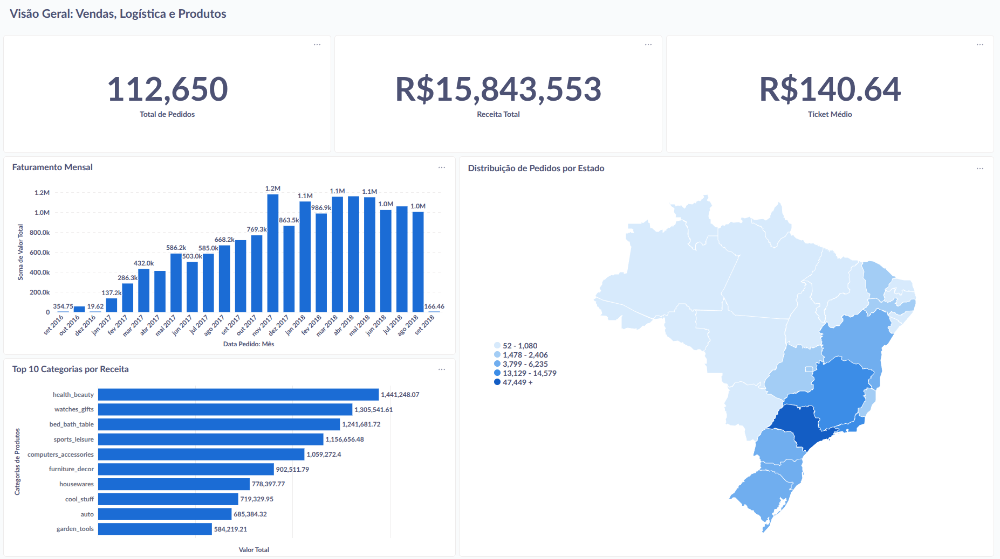

# Olist Data Warehouse (End-to-End ELT Pipeline) 🇧🇷📦

Projeto de Engenharia de Dados completo e automatizado que transforma dados brutos do E-commerce brasileiro (Olist) em inteligência de negócios, utilizando uma arquitetura baseada em contêineres.



## 🚀 Sobre o Projeto
Este repositório implementa um Data Warehouse Corporativo saindo do zero. Diferente de projetos tradicionais onde scripts são rodados manualmente, aqui toda a infraestrutura e o pipeline de dados são orquestrados via **Docker**.

**Principais Características:**
* **Automação Total:** Um único comando sobe o banco, baixa os dados e realiza as transformações.
* **Arquitetura ELT:** Carregamento "Raw" seguido de transformação no banco (Modern Data Stack).
* **Modelagem Dimensional:** Implementação de Star Schema para performance analítica.
* **Reprodutibilidade:** Uso de variáveis de ambiente e containers para garantir que funcione em qualquer máquina.

## 🛠 Tech Stack

| Componente | Tecnologia | Função |
| :--- | :--- | :--- |
| **Ingestão** | Python (Pandas + Kaggle API) | Baixar CSVs e carregar no Postgres (Staging). |
| **Armazenamento** | PostgreSQL 15 | Data Warehouse (Schemas `raw` e `dw`). |
| **Transformação** | dbt (Data Build Tool) | Modelagem, testes e documentação de dados. |
| **Orquestração** | Docker Compose | Gerenciamento dos serviços e dependências. |
| **Visualização** | Metabase | Dashboards interativos e KPIs. |

## 🏗 Arquitetura de Dados

O fluxo de dados segue o padrão **ELT** (Extract, Load, Transform):

1.  **Source:** Dados públicos da Olist (Kaggle).
2.  **Staging (Schema `raw`):** Dados carregados "as-is" (como estão) via script Python automatizado.
3.  **Core (Schema `dw`):** O **dbt** lê do `raw`, limpa, traduz e modela em **Star Schema** (Fato/Dimensão).
4.  **Analytics:** O Metabase consome as tabelas modeladas para gerar insights.

## ⚙️ Como Rodar (One-Click Setup)

### Pré-requisitos
* Docker e Docker Compose instalados.
* Uma conta no Kaggle (para gerar o token de API).

### Passo a Passo

1.  **Clone o repositório:**
    ```bash
    git clone [https://github.com/seu-usuario/olist-dw.git](https://github.com/seu-usuario/olist-dw.git)
    cd olist-dw
    ```

2.  **Configure as credenciais:**
    Renomeie o arquivo de exemplo e adicione suas chaves do Kaggle:
    ```bash
    cp .env.example .env
    ```
    *Edite o arquivo `.env` e preencha `KAGGLE_USERNAME` e `KAGGLE_KEY`.*

3.  **Execute o Projeto:**
    Este comando subirá o banco, o Metabase e disparará o container de ETL automaticamente:
    ```bash
    docker compose up --build
    ```

4.  **Acesse:**
    * Aguarde o container `olist_dw_etl` finalizar (log: `exited with code 0`).
    * Abra o Metabase: **http://localhost:3000**
    * Conecte ao banco de dados (Host: `db`, User: `user`, Pass: `password`, DB: `olist_dw`).

## 📊 Modelagem (Star Schema)

O modelo foi desenhado para responder perguntas de Vendas, Logística e Produto.

* **Fato:** `fato_vendas` (Granularidade: Item do Pedido)
* **Dimensões:** `dim_clientes`, `dim_produtos`, `dim_vendedores`

## 📊 Visualização (Como Reproduzir o Dashboard)

> ⚠️ **Nota Importante:** O Metabase armazena suas configurações (dashboards e perguntas) em um banco de dados interno. Como este projeto provisiona uma infraestrutura limpa e reprodutível, ao rodar o `docker compose`, o Metabase iniciará "zerado".
>
> **Não se preocupe:** Todos os dados modelados (Star Schema) já estarão carregados e prontos no banco de dados. Siga os passos abaixo para recriar as visualizações em poucos minutos.

### 1. Sincronização Inicial
Antes de começar, garanta que o Metabase reconheceu as tabelas criadas pelo dbt:
1. Vá em **Configurações do Administrador (⚙️)** > **Bancos de dados** > **Olist DW**.
2. Clique em **"Sincronizar esquema do banco de dados agora"**.
3. Verifique se as tabelas do schema `dw` (`Fato Vendas`, `Dim Clientes`, etc.) apareceram em "Navegar pelos dados".

### 2. Recriando os KPIs e Gráficos
Utilize a tabela **`Fato Vendas`** como fonte principal para criar as seguintes "Perguntas":

* **💰 KPI - Receita Total:**
    * *Métrica:* Soma de `Valor Total`.
    * *Visualização:* Número (Compacto).
* **📦 KPI - Volume de Pedidos:**
    * *Métrica:* Contagem de linhas.
    * *Visualização:* Número.
* **📈 Tendência de Faturamento:**
    * *Métrica:* Soma de `Valor Total`.
    * *Agrupamento:* `Data Pedido` (por Mês).
    * *Visualização:* Barra ou Linha.
* **🗺️ Mapa Logístico (Clientes):**
    * *Join:* `Fato Vendas` com `Dim Clientes`.
    * *Agrupamento:* `Estado` (da tabela Clientes).
    * *Visualização:* Mapa de Região (Selecionar "Brazil" nas configurações).
* **🏆 Top Categorias:**
    * *Join:* `Fato Vendas` com `Dim Produtos`.
    * *Métrica:* Soma de `Valor Total`.
    * *Agrupamento:* `Categoria`.
    * *Filtro:* Remover categorias nulas/vazias.
    * *Visualização:* Barra Horizontal (Ordenar decrescente).

---

## 📈 Resultados e KPIs
O dashboard final oferece uma visão executiva com:
* **KPIs:** Receita Total, Volume de Pedidos e Ticket Médio.
* **Tendência:** Evolução mensal do faturamento (2016-2018).
* **Geografia:** Mapa de calor de clientes por estado.
* **Produto:** Ranking de categorias (Curva ABC).